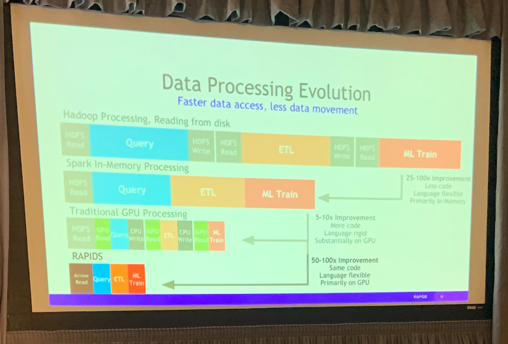
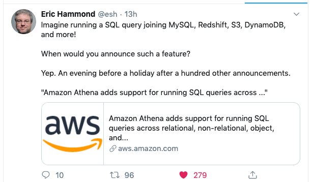
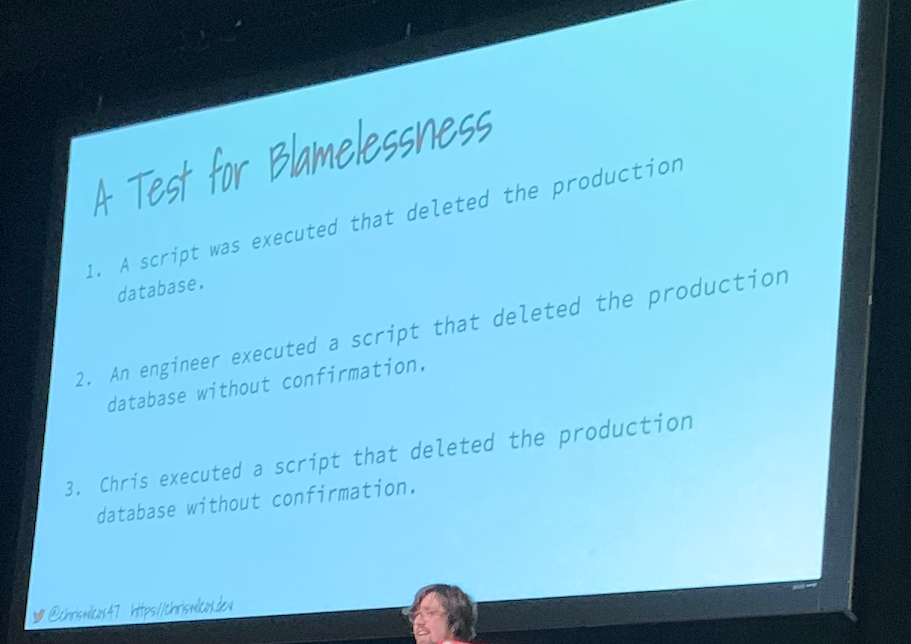
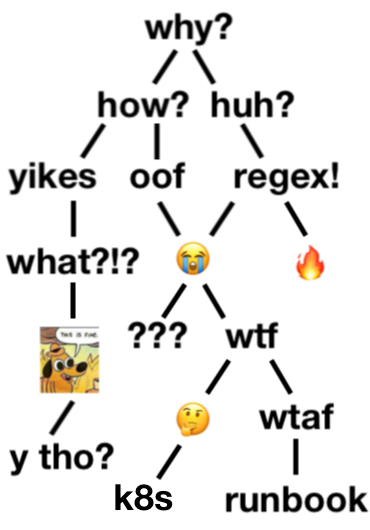

# Introduction

https://2019.pycon.ca/

Note that this note is fairly opionionated.

# Goal

- See what other people are doing with Python, it may refects the trends of technology.
- Meet people.
- Contribute to one open source project.

# Data science

## Debugging Jupyter Notebooks

- Maria Khalusova
- JetBrains
- @mariakhalusova

Jupyter Notebook is popular tool for data scientists, it allows you to create and share documents that contain live code, visualizations and narrative text. It's like [literate programming paradigm](https://en.wikipedia.org/wiki/Literate_programming) introduced by Knuth.

An example of jupyter notebook: https://github.com/norvig/pytudes/blob/master/ipynb/Scrabble.ipynb

- %xmode
  - plain
  - context
  - minimal
  - verbose
- %debug
- Add set_trace() in code
- ipdb
- Python 3.7: breakpoint()
- IDE conditional breakpoint
- jb.gg/debugger

But missing two methods I like:
- printing logs (I am old school)
- staring at the code

## RAPIDS and cuDF: accelerating DataFrames on GPUs

- Ashwin Srinath and Keith Kraus
- https://github.com/rapidsai/cudf
- https://rapids.ai/about.html


Python + GPU = Prductivity + Performance

- why gpus?
  - > 1000 cores, 15 TeraFlops
  - 1 TB/s memory bandwitdth
- Apache Arrow
  - Columnar memory layout allows applications to avoid unnecessary IO and accelerate analytical processing performance on modern CPUs and GPUs
- GPUs are hard
  - too much data movement
  - write gpu code is hard
  - fragmented ecosystem
  - no python api for data manipulation
- Python + gpus
  - python for productivity, gpus for performance
- Pandas-like API
  - easy to migrate



## PySpark

### Workd count example

In PySpark:

```python
text_file = sc.textFile("hdfs://...")
counts = text_file.flatMap(lambda line: line.split(" ")) \
                  .map(lambda word: (word, 1)) \
                  .reduceByKey(lambda a, b: a + b)
counts.saveAsTextFile("hdfs://...")
```
In Hadoop:

Hhttps://hadoop.apache.org/docs/current/hadoop-mapreduce-client/hadoop-mapreduce-client-core/MapReduceTutorial.html#Example:_WordCount_v1.0

### High level APIs: SQL and DataFrame

```python
# Spark's Python DataFrame API Read JSON files with automatic schema inference

df = spark.read.json("logs.json")
df.where("age > 21")
  .select("name.first").show()
```

```python
# Apply functions to results of SQL queries.
results = spark.sql(
  "SELECT * FROM people")
names = results.map(lambda p: p.name)
```




# Container & k8s


## Container Workflows for Python Developers

- Aaron Wislang
- https://github.com/asw101/2019-containers-python
- https://2019.pycon.ca/talks/talk-t-601/

This was a hands-on tutorial from Microsoft, the vsonline is pretty cool. In this tutorial, we did everything in Browser. It covered docker, k8s, ML topics, I haven't digested all the information.

My takeaways are:
- vsonline is pretty cool.
- Should learn more about k8s and docker.

# Compiler & interpreters


## Fun with compilers: exploring languages one Python at a time

- 12:20 ~ 12:45
- @pdmccormick

Before we get started a question for you: Is Python a compiled or interpreted lanague?


https://github.com/pdmccormick/pyconca2019-fun-with-compilers

Why are compilers fun?

1. Data structures & algorithms
2. Software architecutre & design
3. Language design

This talks basically covers the standard steps of a compiler: 

- lexer -> parser -> code generation -> run it on a VM or Hardware.

The advantage of doing this in Python, because it's easy to hack and play with it (but it's slow).

## Keynote from mozilla

- 13:45
- William Lachance

Before we get started, you need to know a little bit about WebAssembly: https://youtu.be/u2kKxmb9BWs?t=107


This is a cool project, it basically compiles Python to WebAssembly, and run it in your browser, it combine Python, JavaScript, Markdown, CSS to your data analysis. And you don't need to install anything, it's just right there.

- https://alpha.iodide.io/

## Closing Keynote: A Talk Near the Future of Python

- David Beazley (@dabeaz)

This is a great talk. @dabeaz started with a simple stack VM and gradually built it up into a WebAssembly interpreter. I wrote (copied) the code (https://github.com/zzl0/code/tree/master/code/rocket) while I was watching the video, it was fun to play the rocket game in your own interpreter.

Unfortunately, this is not a talk in PyCon Canada.


# Others

## The blameless post mortem: how embracing failure makes us better

https://landing.google.com/sre/sre-book/chapters/postmortem-culture/

- A Test for **Blamelessness**



<br/>

- Five Whys vs Reality





## Handling datetimes without losing your head

- Valery Calderon
- https://2019.pycon.ca/talks/talk-209/

I was disappointed because I thought she would talk about business problems casued by datetimes. Actually, this talk just covered the standard way to process datetimes in Python.


From wikipedia.


## keynote from shopify


data informed deision making

- acquire domain knowledge
- set up tripwires
- reducing uncertainty with new data points
- know you baseline and your variance
- act on your insight

## How to level up

- 16:05 ~ 16:30
- https://2019.pycon.ca/talks/talk-97


https://github.com/lmontopo/HowToLevelUp/blob/master/HowToLevelUp.pdf

- Be curious
  - Ask questions
  - Be open to learning from anyone
  - Focus on learning goals
  - Contemplate if there is a better way
  - Learn about the tools you use
  - Experimenting
- Be brave
  - volunteer for things that scare you
  - Teach others, even if you aren't an expert
  - Ask basic and dumb questions
  - Read things you don't understand
- be dissatisfied
  - hunting for inefficiencies
  - have pet projects
  - make things faster
- be reflective
  - journal everyday
  - learn from your successes and your failures
